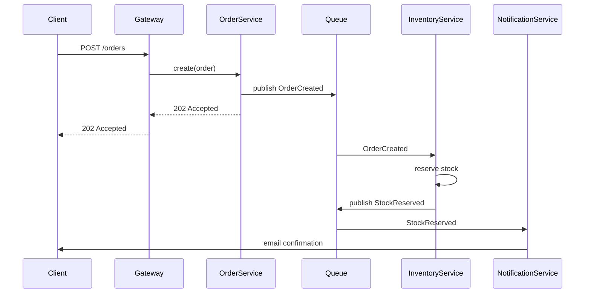
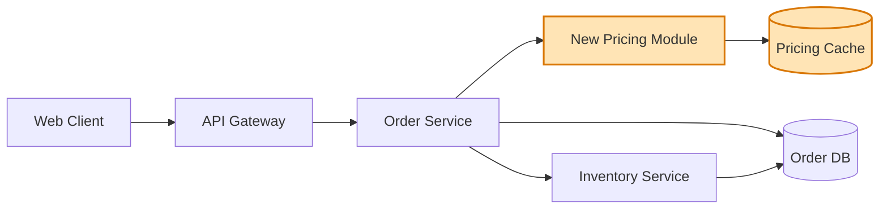
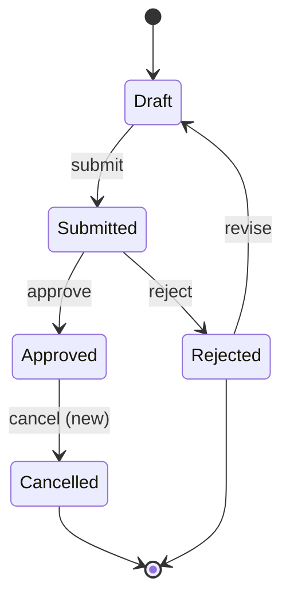

# Architecture Mapping

When and how to produce a Mermaid diagram as part of the Test Surface Map. A diagram earns its place when prose and tables genuinely don't capture the change - for a single-module update, a diagram is noise. For cross-cutting work it's the difference between "we tested the diff" and "we understood the blast radius."

## When to generate a diagram

Generate one when **any** of these conditions hold:

- The change touches more than 2 services, or more than 3 modules in a service
- The change crosses an asynchronous boundary (message queue, event bus, scheduled job, webhook)
- A new external dependency is introduced (a new API call, a new database, a new third-party service)
- The change alters the order or fan-out of an existing distributed operation
- The change introduces or modifies a state machine with more than 3 states
- A reviewer is likely to ask "wait, how does this hang together?" - if the diff is large enough that the answer takes a paragraph of prose, a diagram is cheaper

Generate **none** when:

- The change is contained within a single module or file
- The data flow is linear and entirely within one service
- An existing architecture doc covers the affected area unchanged - reference it instead of duplicating
- The user explicitly says "no diagrams"

## When to ask rather than generate

If the change spans services in a way the code doesn't fully reveal - typical signs are an event published with no visible consumer in the repo, or a call to a service whose contract isn't in the codebase - ask the user before drawing. The failure mode is generating a plausible-looking diagram that omits a consumer, which is worse than no diagram because it implies a completeness the agent doesn't have.

Form of the ask: "I can map this from the diff, but the boundary between Service A and the new module isn't clear from the changed files - is there an existing architecture sketch, or can you describe the missing piece?"

## Which diagram type to pick

Three patterns cover almost everything:

### Sequence diagram - for request flows and async messages

Use when the *order of operations* is the interesting thing. Best for HTTP request chains, message-published-then-consumed flows, and saga / compensating-transaction patterns.

Annotate failure modes inline as notes (`Note over Queue: timeout → DLQ after 3 retries`) when they're test-relevant - the diagram doubles as documentation for the negative scenarios in the map's Priority 2.

### Component / flowchart diagram - for module boundaries and dependencies

Use when the *structure* matters more than the order - what depends on what, where the new module sits, which existing modules its changes affect.

Highlight changed components with a class (`:::changed` in the example) so the visual scan shows the blast radius at a glance.

### State diagram - for state machines and lifecycle changes

Use when the change adds, removes, or modifies states or transitions. Common for order/booking lifecycles, subscription states, approval workflows.

When the change *adds* a transition, label it `(new)` in the diagram. The eye picks it up immediately, and the corresponding negative tests in the Priority 2 section follow naturally - what happens if `Cancelled → Approved` is attempted? Does the rollback path work?

## What to include

- The components or actors that exist *before* the change
- The components, calls, or states the change *adds* (highlighted)
- The components the change *modifies* (highlighted differently from added, if both are present)
- Inline notes for failure modes that are test-relevant (timeout, retry, idempotency requirement)
- A short caption above the diagram stating what scope it shows

## What to omit

- Components untouched by the change, unless they're necessary to understand the flow
- Generic infrastructure (load balancers, CDNs) unless the change involves them
- Implementation detail (specific class names, framework versions) - the diagram is about behaviour, not code

## How the diagram links to test scenarios

Each highlighted (changed) element in the diagram should map to at least one Priority 1 or Priority 2 scenario in the same Test Surface Map. After drawing, scan the diagram:

- For each changed component: is there a scenario that verifies its new behaviour?
- For each new edge / call / transition: is there a scenario for the happy path and at least one failure mode?
- For each preserved component touching a changed one: is there a regression scenario?

If a diagram element has no corresponding scenario, either the scenario is missing or the diagram is showing more than it should. Either way, the discrepancy is worth resolving before qa-writer consumes the map.

## Rendering

The diagram is plain Mermaid in a code block - no rendering required at write time. GitHub, GitLab, Bitbucket, Notion, Confluence, Slack with the right app, and most modern IDEs render Mermaid natively. The Jira MCP-posted comment renders if the Jira instance has the Mermaid plugin; otherwise it appears as a code block, which is still readable.

Keep diagrams under ~20 nodes. If the change genuinely spans more than that, split into two diagrams (one per slice) rather than one cluttered one.
